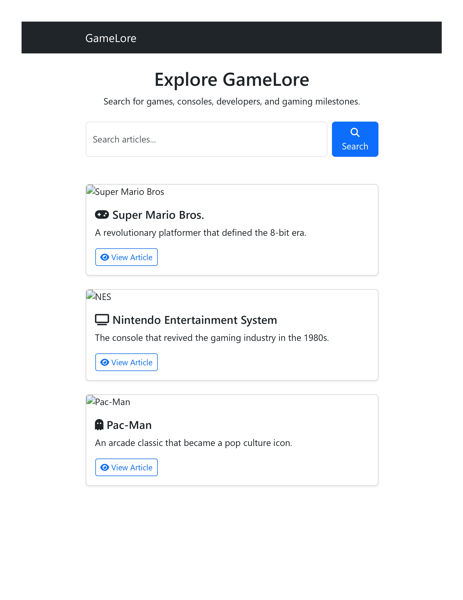
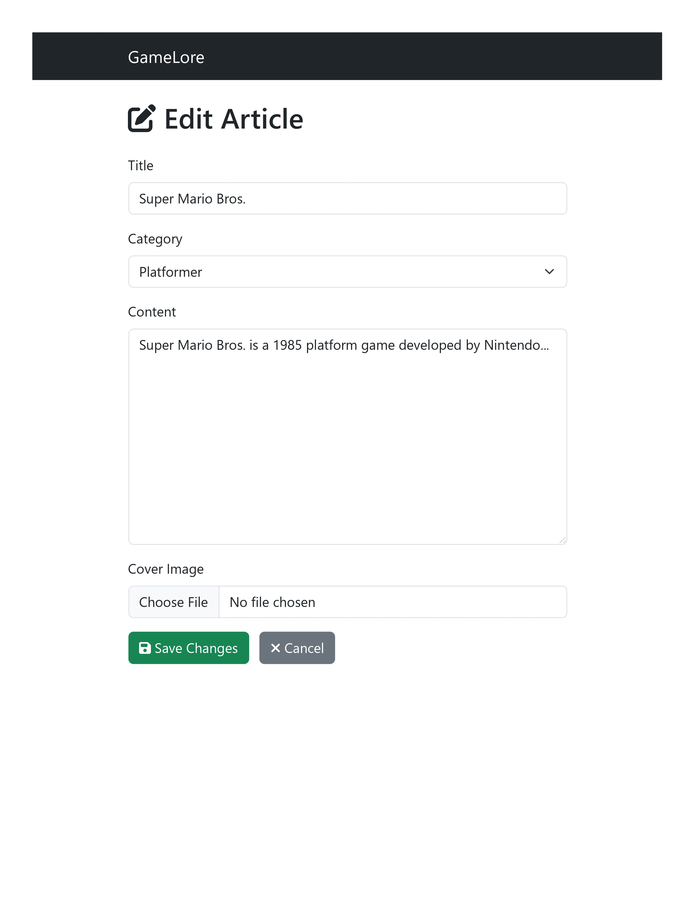

# 🎮 GameLore

> Preserving the stories and evolution of gaming — one article at a time.  
> A mini-Wikipedia built with **ASP.NET Core MVC** that lets users **search, view, and edit** articles about video game history.

---

## 📘 Overview
**GameLore** is a mini-Wikipedia-style encyclopedia that focuses on the history and evolution of video games.  
Users can explore articles about consoles, developers, iconic titles, and key moments in gaming history.  
Logged-in users can also edit or add new articles to expand the archive.

This project combines ASP.NET Core MVC architecture with a clean, Bootstrap-based interface to deliver a user-friendly experience.

---

## 🎯 Objective
The objective of **GameLore** is to design a dynamic encyclopedia web app that makes it easy to discover and share information about gaming history.  
Wireframes were created to visualize the user experience from search to article viewing and editing, ensuring logical data flow and clarity.

---

## ⚙️ Key Features
- 🎮 **Explore Gaming History** – Read about games, consoles, and industry milestones  
- 🔍 **Search & Filter** – Find articles by title, keyword, or category  
- ✏️ **User Contributions** – Logged-in users can edit or create articles  
- 🕒 **Edit History Tracking** – See who made changes and when  
- 🗂️ **Category Browsing** – Browse entries by platform, genre, or decade  
- 👤 **Authentication** – Restricts editing to registered users  

---

## 🧩 Technical Stack
- **Framework:** ASP.NET Core MVC (C#)  
- **Database:** SQL Server / SQLite  
- **Frontend:** HTML5, CSS3, Bootstrap, jQuery  
- **Authentication:** ASP.NET Identity  
- **Search Logic:** LINQ-based keyword search  

---

## 🗃️ Data Model
| Entity | Description | Key Fields |
|--------|--------------|-------------|
| **Article** | Stores encyclopedia entries | Id, Title, Content, CategoryId, CreatedAt, UpdatedAt |
| **Category** | Groups related articles | Id, Name |
| **EditHistory** | Tracks article revisions | Id, ArticleId, UserId, Timestamp, PreviousContent |
| **User** | Registered contributors | Id, Username, Email, PasswordHash |

---

## 🎨 Wireframes

### 🏠 Home / Search Page
Search for games, consoles, or developers.

### 📄 Article View Page
View article details with metadata and an edit option (if logged in).

### ✏️ Edit / Add Article Page
Form for creating or updating articles.

---

## 🧭 Design Process
The design process began by mapping the user journey — from searching for a topic, viewing details, and optionally editing or adding new content.  
Wireframes clarified data flow and made it easier to define the relationships between models like `Article`, `Category`, and `EditHistory`.

This planning ensured the UI stayed intuitive and that all required data was available where needed.

---

## 🚀 Future Enhancements
- 🎨 Add cover images or screenshots for articles  
- 🕹️ Include game release timelines or trivia sections  
- 🧠 Add tagging and related articles suggestions  
- 🛡️ Role-based admin controls for moderation  

---

## 📚 License
This project was created for **educational purposes** as part of a web development course.

---

💡 *"Every game tells a story — GameLore keeps them alive."*
